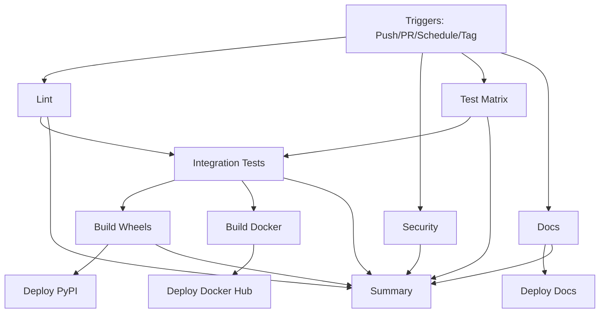

# GitHub Actions Workflows

This directory contains the CI/CD workflows for the Triton DSL project.

## Workflows

### ci.yml - Comprehensive CI/CD Pipeline

**Status**: [](https://github.com/financecommander/Triton/actions/workflows/ci.yml)

The main CI/CD pipeline that handles:

- ✅ Code quality checks (Black, Ruff, Flake8, MyPy)
- 🔒 Security scanning (Bandit, Safety)
- 🧪 Unit tests with 80% coverage requirement
- 🔗 Integration and stress tests
- 📚 Documentation building
- 🐳 Docker image builds
- 📦 PyPI package publishing
- 🌐 GitHub Pages deployment

#### Matrix Testing

Tests run across multiple configurations:

| Python | PyTorch | Ubuntu | Windows | macOS |
|--------|---------|--------|---------|-------|
| 3.9    | 2.0     | ✅     | -       | -     |
| 3.9    | 2.1     | ✅     | -       | -     |
| 3.9    | 2.2     | ✅     | ✅      | ✅    |
| 3.10   | 2.0     | ✅     | -       | -     |
| 3.10   | 2.1     | ✅     | -       | -     |
| 3.10   | 2.2     | ✅     | ✅      | ✅    |
| 3.11   | 2.0     | ✅     | -       | -     |
| 3.11   | 2.1     | ✅     | -       | -     |
| 3.11   | 2.2     | ✅     | ✅      | ✅    |
| 3.12   | 2.1     | ✅     | -       | -     |
| 3.12   | 2.2     | ✅     | ✅      | ✅    |

**Note**: Matrix is optimized to reduce CI minutes while maintaining comprehensive coverage.

#### Deployment Triggers

- **PyPI**: Automatically publishes on version tags (`v*.*.*`)
- **Docker Hub**: Builds on pushes to `main` or version tags
- **GitHub Pages**: Deploys documentation on pushes to `main`

## Required Secrets

Configure in repository Settings → Secrets and variables → Actions:

| Secret              | Usage                          |
|---------------------|--------------------------------|
| `CODECOV_TOKEN`     | Coverage reporting to Codecov  |
| `PYPI_API_TOKEN`    | Publishing to PyPI             |
| `DOCKER_USERNAME`   | Docker Hub authentication      |
| `DOCKER_PASSWORD`   | Docker Hub authentication      |

## Documentation

See [CI/CD Guide](../docs/CI_CD_GUIDE.md) for comprehensive documentation including:

- Detailed job descriptions
- Local development workflow
- Troubleshooting guide
- Release process
- Best practices

## Workflow Dependencies



## Quick Reference

### Running Locally

```bash
# Install dependencies
pip install -e ".[dev]"

# Run all checks
black --check .
ruff check .
mypy compiler backend kernels --ignore-missing-imports
bandit -r compiler backend kernels
pytest tests/ -v --cov=. --cov-fail-under=80

# Build package
python -m build

# Build Docker
docker build -t triton-dsl:local .
```

### Manual Workflow Trigger

1. Go to [Actions](https://github.com/financecommander/Triton/actions)
2. Select "CI/CD Pipeline"
3. Click "Run workflow"
4. Select branch and click "Run workflow"

### Creating a Release

```bash
# Update version in pyproject.toml
# Commit changes
git commit -am "Release v1.0.0"

# Create and push tag
git tag v1.0.0
git push origin v1.0.0

# Workflow automatically deploys to PyPI and Docker Hub
```

## Monitoring

- **Workflow runs**: https://github.com/financecommander/Triton/actions
- **Coverage reports**: https://codecov.io/gh/financecommander/Triton
- **PyPI releases**: https://pypi.org/project/triton-dsl/
- **Documentation**: https://financecommander.github.io/Triton/

## Support

For workflow issues:
1. Check the [CI/CD Guide](../docs/CI_CD_GUIDE.md)
2. Review workflow logs in GitHub Actions
3. Open an issue with the `ci/cd` label
